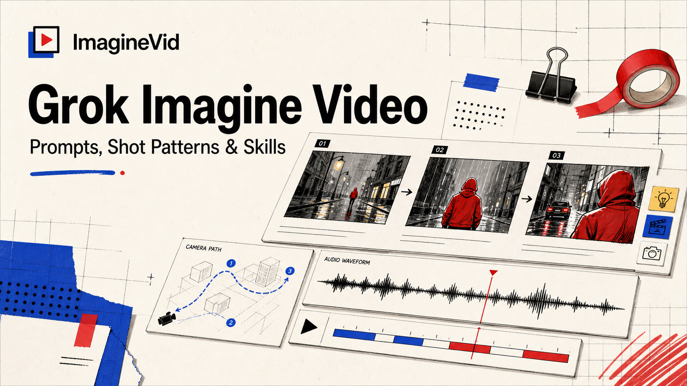

<a href="https://github.com/imaginevid-ai/Awesome-grok-imagine-video-prompts-and-skills">
  
</a>

> A source-verifiable library of shot briefs, motion patterns, and audiovisual workflows for Grok Imagine Video.
# Awesome Grok Imagine Video Prompts & Skills

[](https://github.com/sindresorhus/awesome)
[](https://github.com/imaginevid-ai/Awesome-grok-imagine-video-prompts-and-skills)
[](https://creativecommons.org/licenses/by/4.0/)
[](https://github.com/imaginevid-ai/Awesome-grok-imagine-video-prompts-and-skills/actions)
[](docs/CONTRIBUTING.md)

> Study the prompt, watch the result, trace the creator, and adapt the directing pattern for your next short video

> **Attribution and corrections:** Each published case links to its creator and canonical source. Rights remain with their owners. Open an issue for attribution changes or removal.

---

[](README.md)

---

## Build with Grok Imagine Video

**[Open the Grok Imagine workflow on ImagineVid](https://imaginevid.io/grok-imagine)**

Use this repository to inspect evidence and directing structure; use ImagineVid when you are ready to generate a clip.

The launch data is intentionally empty. Future cases must preserve creator attribution, canonical source, model evidence, and a playable result before publication.

| Production need | Evidence library | ImagineVid workflow |
|---------|--------------|---------------------|
| Case review | Prompt, result, and source | Generate and compare |
| Discovery | Repository text search | Workflow-led exploration |
| Generation | - | Open Grok Imagine |
| Reading | GitHub-native Markdown | Browser production workspace |
| Video workflows | - | Production filters |


### Browse by Production Workflow

- [**Camera Direction & Shot Design**](#workflow-camera-direction-shot-design) - Shot briefs built around framing, camera path, blocking, pacing, reveals, and transitions.
- [**Dialogue, Performance & Native Audio**](#workflow-dialogue-performance-native-audio) - Performance-led prompts where speech, acting, ambience, music, or synchronized sound carries the scene.
- [**Product Motion & Commercial Spots**](#workflow-product-motion-commercial-spots) - Commercial clips that keep a product, offer, garment, dish, device, or brand moment at the center of the motion.
- [**Image-to-Video & Subject Continuity**](#workflow-image-to-video-subject-continuity) - Image-anchored workflows that animate a still while preserving identity, composition, product geometry, or storyboard layout.
- [**Stylized Motion & Visual Effects**](#workflow-stylized-motion-visual-effects) - Effects and animation patterns driven by transformations, simulation, surreal physics, graphic motion, or a distinctive media treatment.
- [**Video Editing, Restyling & Scene Control**](#workflow-video-editing-restyling-scene-control) - Existing-video workflows that restyle, extend, add, remove, replace, or redirect part of a scene while protecting continuity.

---

## Contents

- [Build with Grok Imagine Video](#build-with-grok-imagine-video)
- [What is Grok Imagine Video?](#what-is-grok-imagine-video)
- [Collection Status](#collection-status)
- [Contribute a Verified Case](#contribute-a-verified-case)
- [License](#license)
- [Creator Credits](#creator-credits)
- [Repository Growth](#repository-growth)

---

## What is Grok Imagine Video?

**Grok Imagine Video** is xAI's video-generation and editing system for turning text or a starting image into short clips with synchronized audio. The current `grok-imagine-video-1.5` release is generally available through the xAI API. xAI reports improved motion, physical coherence, speech, sound effects, ambience, and generation speed compared with its previous video model.

This repository treats a prompt as a compact directing brief. A useful case preserves the action, camera path, timing, sound intention, continuity constraints, result video, creator, and canonical source so readers can judge both the instruction and the outcome.

- **Start from text or a frame** - Generate from a written scene or animate an image that already carries the composition
- **Direct motion and physics** - Describe blocking, momentum, object interaction, and what must remain stable through the shot
- **Work in short production loops** - Test a clear beat, inspect the clip, then tighten timing, camera, or performance
- **Generate sound with the scene** - Include dialogue, ambience, music, or effects when audio is part of the storytelling
- **Edit existing footage** - Restyle a clip, change scene conditions, or add, remove, and replace visible elements
- **Keep the brief shootable** - One primary action and one deliberate camera idea usually outperform an overloaded mini-film

**Current references:** [xAI Video 1.5 release](https://x.ai/news/grok-imagine-video-1-5) · [xAI model documentation](https://docs.x.ai/developers/models/grok-imagine-video) · [Grok Imagine on ImagineVid](https://imaginevid.io/grok-imagine)

### Turn a Prompt into a Shot Template

Reusable video prompts separate variables from directing logic. Replace the subject, location, spoken line, or product while preserving the tested camera path, timing, and continuity rules.

**Template pattern:**
```
[SUBJECT] performs [ACTION] in [LOCATION]. Camera: [SHOT + MOVE]. Timing: [BEATS]. Audio: [DIALOGUE / AMBIENCE]. Preserve: [IDENTITY / PRODUCT / LAYOUT].
```

Change only the bracketed production variables first. Revise the shot grammar only after you know which part of the result needs correction.

---

## Collection Status

<div align="center">

| Collection field | Current value |
|--------|-------|
| Verified Cases | **0** |
| Editorial pick | **0** |
| Generated | **Tuesday, July 14, 2026 at 10:53:14 AM UTC** |

</div>

---

## Contribute a Verified Case

Found a Grok Imagine Video case that teaches a real directing pattern? Submit the prompt, playable result, creator, source, model evidence, and input mode through GitHub Issues.

### GitHub issue

1. [**Submit a video prompt**](https://github.com/imaginevid-ai/Awesome-grok-imagine-video-prompts-and-skills/issues/new?template=submit-prompt.yml)
2. Provide the full brief, source, creator, model evidence, and playable media
3. A maintainer checks provenance, video value, scope, and duplicates
4. Approved cases are normalized into the local data source
5. The generator publishes the case after all quality checks pass

**Editorial rule:** Popularity is not evidence. A low-engagement post with a complete prompt and useful video can outrank a viral showcase with no reproducible direction.

Read [CONTRIBUTING.md](docs/CONTRIBUTING.md) before submitting.

---

## License

Repository editorial text is licensed under [CC BY 4.0](https://creativecommons.org/licenses/by/4.0/); source media retains its original ownership.

---

## Creator Credits

<details>
<summary>Community creators we thank (0)</summary>


</details>

---

## Repository Growth

[](https://github.com/imaginevid-ai/Awesome-grok-imagine-video-prompts-and-skills/stargazers)

**[Repository Growth](https://star-history.com/#imaginevid-ai/Awesome-grok-imagine-video-prompts-and-skills&Date)**

---

<div align="center">

**[Build with Grok Imagine Video](https://imaginevid.io/grok-imagine)** •
**[Submit a verified case](https://github.com/imaginevid-ai/Awesome-grok-imagine-video-prompts-and-skills/issues/new?template=submit-prompt.yml)** •
**[Star the collection](https://github.com/imaginevid-ai/Awesome-grok-imagine-video-prompts-and-skills)**

<sub>Generated from versioned local data on 2026-07-14T10:53:14.887Z</sub>

</div>
